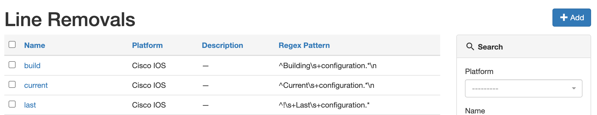
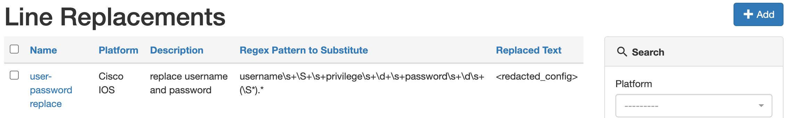

# Configuration Backup

The backup configuration process requires the Nautobot worker to connect via Nornir to the device, and run the `show run` or equivalent command, 
and save the configuration. The high-level process to run backups is:

* Download the latest version of each of the Git repositories configured with the `backup configs` capability within Nautobot.
* Run a Nornir play to obtain the cli configurations.
* Optionally perform some lightweight processing of the backup.
* Store each device's backup configuration file on the local filesystem.
* Commit all files added or changed in each repository.
* Push configuration files to the remote Git repositories.

## Configuration Backup Settings

Backup configurations often need some amount of parsing to stay sane. The two obvious use cases are the ability to remove lines such as the "Last 
Configuration" changed date, as this will cause unnecessary changes the second is to strip out secrets from the configuration. In an effort to support these 
uses cases, the following settings are available and further documented below.

* Config Removals - provides the ability to remove a line based on a regex match.
* Config Replacements - provides the ability to swap out parts of a line based on a regex match.

### Backup Repositories

In the `Backup Repositories` field of the UI, configure all of the repositories which you intend to use for backed-up device configurations as part of Golden Config.

Backup repositories must first be configured under **Extensibility -> Git Repositories**. When you configure a repository, look for the `Provides` field in the UI. To serve as a configuration backup store, the repository must be configured with the `backup configs` capability under the `Provides` field. For further details, refer to [Navigating Nautobot Git Settings](./navigating-golden.md#git-settings).

### Backup Repository Matching Rule

.. Note::
    Only use a Backup Repository Matching Rule if you have **more than one** backup repository. It is not needed if you only have one, and will cause backup failures for any devices which do not match the rule. The setting is mandatory if you have more than one repository.

The `backup_repository_matching_rule` setting allows you to match a given `Device` Django ORM object to a backup Git repository. This field should contain a Jinja2-formatted template. The plugin populates the variables in the Jinja2 template via the GraphQL query configured on the plugin.

Say that in your environment you have three regions in which your devices reside: North America, Asia Pacific, and Africa. You have populated these values as `Region` objects in Nautobot, and assigned a `Region` value to each of your devices. You want your backup solution to scale well, so you have a dedicated backup Git repository for each region. Every Nautobot object has a `slug` (URL compatible) name in addition to its human-friendly name; our regions' slugs are `north-america`, `asia-pacific`, and `africa`. To configure the plugin to match devices to the desired Git repository, you must first configure the GraphQL query; a _VERY_ simple one might look like this:
```
query ($device_id: ID!) {
  device(id: $device_id) {
    config_context
    hostname: name
    platform {
      manufacturer {
        name
      }
      name
      napalm_driver
      slug
    }
    primary_ip4 {
      address
      interface {
        name
      }
      id
    }
    site {
      name
      region {
        name
        slug
      }
      slug
    }
  }
}
```

The query will look at the `Device` ORM object, and return the values from the query as keys under the top-level `obj` key. The `obj` key represents the Device object. With this GraphQL query, we can make a Jinja2 template to translate the returned values into a string. For example, say that you have a device which is in your Sydney, AU office, which is in the `asia-pacific` region in Nautobot. If you made a Jinja2 template based on that, which looked like this:

```
{{obj.site.region.slug}}
```
Then the template would be rendered to the string:
```
asia-pacific
```

When you create backup repositories, pay attention to your naming scheme. You should name each repository in a way that matches the value of whatever parameter from the Device object which you wish to use to sort devices into repositories. So, for our Sydney device above, it would work to name your Asia Pacific repository something "Asia Pacific Device Backups". This would give it a `slug` value of `asia-pacific-device-backups`, and you could use this in a backup repository matching rule with a template like this:

```
{{obj.site.region.slug}}-device-backups
```

### Backup Path Template

The `backup_path_template` setting gives you a way to dynamically place each device's configuration file in the repository file structure. This setting uses the GraphQL query configured for the plugin. It works in a similar way to the Backup Repository Matching Rule above. Since the setting uses a GraphQL query, any valid Device model method is available. The plugin renders the values from the query, using Jinja, to the relative path and file name in which to store a given device's configuration inside its backup repository. This may seem complicated, but the equivalent of `obj` by example would be:

```python
obj = Device.objects.get(name="nyc-rt01")
```

An example would be:
```python
backup_path_template = "{{obj.site.slug}}/{{obj.name}}.cfg"
```

With a Sydney, AU device `SYD001AURTR32`, in the site named `Sydney001` and the GraphQL query and `backup_path_template` configured above, our backed-up config would be placed in the repo in `/sydney001/SYD001AURTR32.cfg`.  The site value `sydney001` here is lower case because our template refers to the `slug` value, which by default will be lower case.

The backup process will automatically create folders as required based on the path definition. 

The `backup_path_template` can be set in the UI.  For navigation details [see](./navigating-golden.md#application-settings).

### Device Login Credentials

The credentials/secrets management is further described within the [nautbot-plugin-nornir](https://github.com/nautobot/nautobot-plugin-nornir)
repository. For the simplist use case you can set environment variables for `NAPALM_USERNAME`, `NAPALM_PASSWORD`, and `DEVICE_SECRET`. For more
complicated use cases, please refer to the plugin documentation linked above.

## Starting a Backup Job

To start a backup job manually:

1. Navigate to the Plugin Home (Plugins->Home), with Home being in the `Golden Configuration` section
2. Select _Execute_ on the upper right buttons, then _Backup_
3. Fill in the data that you wish to have backed up
4. Select _Run Job_

## Config Removals

The line removals settings is a series of regex patterns to identify lines that should be removed. This is helpful as there are usually parts of the
configurations that will change each time. A match simply means to remove.

In order to specify line removals. Navigate to **Plugins -> Config Removals**.  Click the **Add** button and fill out the details.

The remove setting is based on `Platform`.  An example is shown below.


## Config Replacements

This is a replacement config with a regex pattern with a single capture groups to replace. This is helpful to strip out secrets.

The replace lines setting is based on `Platform`.  An example is shown below.



The line replace uses Python's `re.sub` method. As shown, a common pattern is to obtain the non-confidential data in a capture group e.g. `()`, and return the rest of the string returned in the backrefence, e.g. `\2`.

```python
re.sub(r"(username\s+\S+\spassword\s+5\s+)\S+(\s+role\s+\S+)", r"\1<redacted_config>\2", config, flags=re.MULTILINE))
```