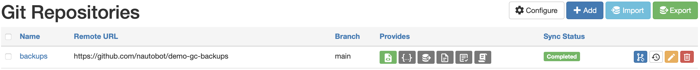

# Usage

The backup configuration process relies on the ability for the nautobot worker to connect via Nornir to the device, run the show run or equivalent command and save the configuration.

# Setting up a Git repository for Backups

The first step is to go to Nautobot and navigate to the Data Sources Git integration. `Extensibility -> Git Repositories`.

From the Git Repositories page we an add the **Backup** repository.

Click on `[+ADD]`.

You will now be presented with a page to fill in the repository details.

Parameters:
|Field|Explanation|
|:--|:--|
|Name|User friendly name for the backup repository.|
|Slug|Auto-generated based on the `name` provided.|
|Remote URL|The URL pointing to the Git repository that stores the backup configuration files. Current usage is limited to `http` or `https`.|
|Branch|The branch in the Git repository to use. Defaults to `main`.|
|Token|The token is a personal access token for the `username` provided.  For more information on generating a personal access token. [Github Personal Access Token](https://docs.github.com/en/github/authenticating-to-github/creating-a-personal-access-token)
|Username|The github username that coresponds with the personal access token above.|
|Provides|Valid providers for Git Repositories.|
 

Select `backup configs`. and click on `[Create]`.

Once you click `[Create]` and the repository syncs, the main page will now show the repository along with its status.

