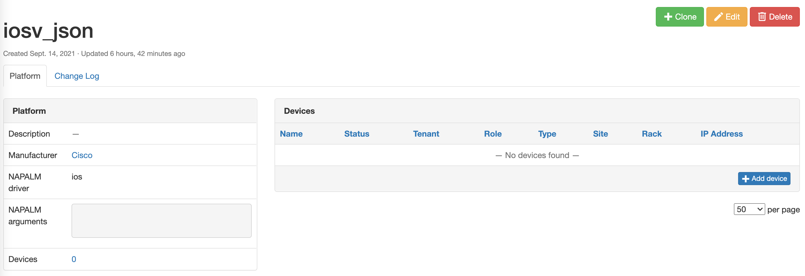
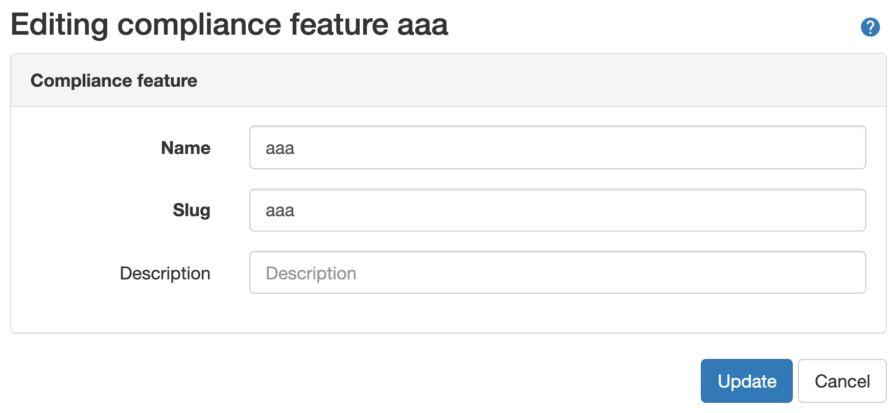
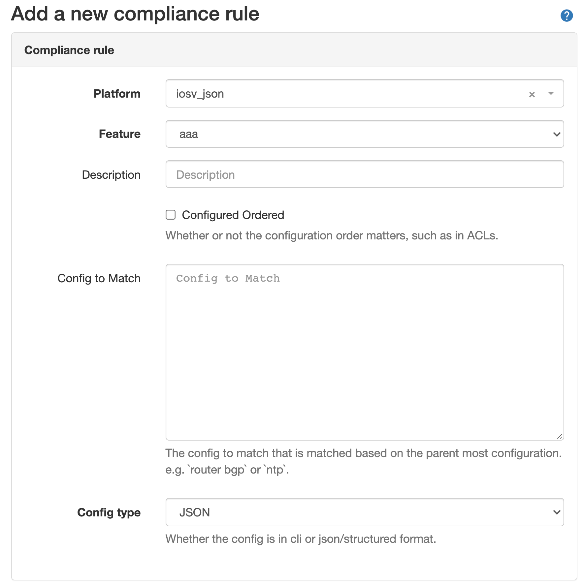
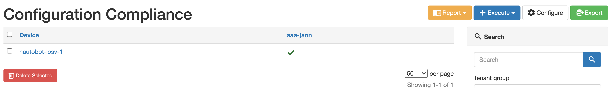
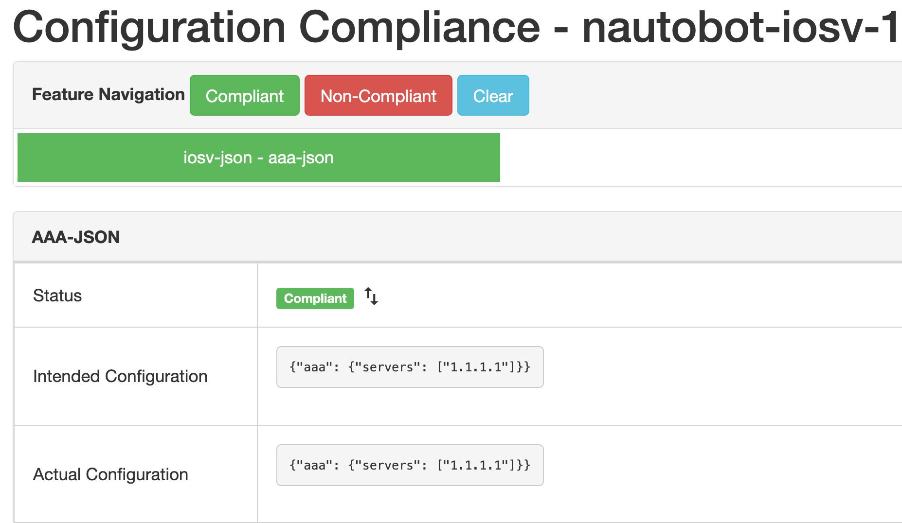
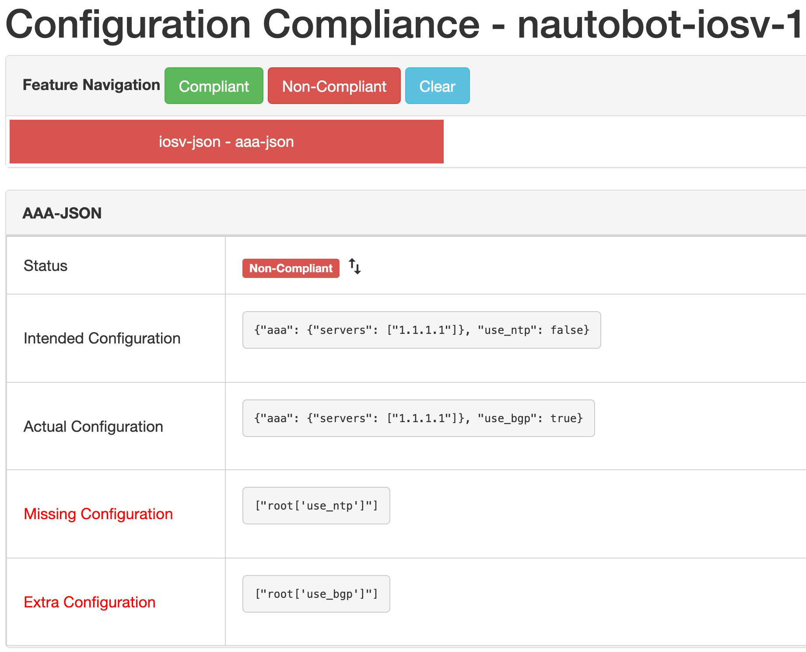

# Navigating Compliance Using Structured Data

> Warning:
This feature is in early development and is only implemented within the API.  There are multiple caveats that need to be considered and are listed below.

## Caveats
- Must have a `Platform` created specifically for the feature.
- Both the compliance `feature` and `rule` need to be unique for the JSON `config-type`.
- When creating `Compliance Rules` with the config type of JSON, the `config to match` field is not used but must have bogus data in order to save to the DB.
- Does **NOT** require Git repositories and for backup and intended.

## Quick Start Guide

1. To get started with the structured data(JSON) compliance check the first step is to create a platform.



2. Next, the compliance feature needs to be created.


3. Link the feature that was just created to a rule definition.


> Notice: Bogus text data `none` was added to `Config to Match` which is not used in the current implementation.

4. Now that the definitions are created and the rule is mapped to the platform we created the API execution can be performed.

Here is an example of a `POST` to the `/plugins​/golden-config​/config-compliance​/` endpoint.

```json
{
  "actual": "{\"aaa\": {\"servers\": [\"1.1.1.1\"]}}",
  "intended": "{\"aaa\": {\"servers\": [\"1.1.1.1\"]}}",
  "device": "472c3786-4499-4e34-8d8e-291c4c7f32a9",
  "rule": "87cc003b-9025-472d-bf3c-e5b62bf91987"
}
```

> Notice: The UUID is needed for the device and rule to execute against.  This data can be found in the UI or by querying the proper endpoints, `/plugins/golden-config/compliance-rule/` and `/dcim​/devices​/`.

Once the API call is made the response data provides a quick snapshot.
```json
{
  "id": "be35a701-0cb0-418a-98e7-a82d99db857e",
  "device": "472c3786-4499-4e34-8d8e-291c4c7f32a9",
  "rule": "87cc003b-9025-472d-bf3c-e5b62bf91987",
  "actual": "{\"aaa\": {\"servers\": [\"1.1.1.1\"]}}",
  "intended": "{\"aaa\": {\"servers\": [\"1.1.1.1\"]}}",
  "ordered": true,
  "compliance": true,
  "display": "nautobot-iosv-1 -> iosv-json - aaa-json -> True"
}
```

You can also see the compliance data in the UI once it is created via API.

In the navigation menu: `Plugins -> Configuration Compliance`.



With the detailed view:



Example of a Non-Compliant rule:



> Note:
All subsequent updates to the compliance rule need to use the `PUT` or `PATCH` API methods and they need to provide the UUID that was created for the specific compliance execution. This UUID is generated by (unique_together = ("device", "rule"))
