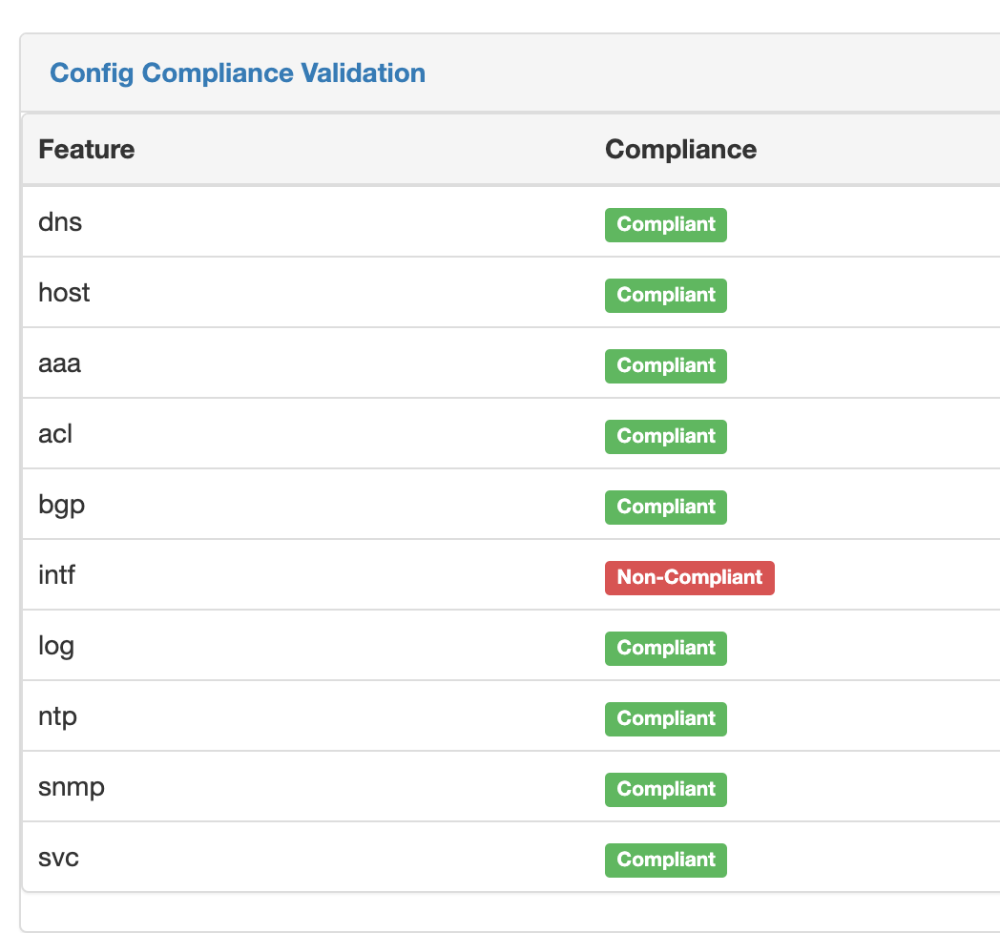

# Configuration Compliance 

The following should be noted by what is meant by configuration compliance. Configurations are considered to be compliant if the generated configuration 
(generally by merging data and Jinja2, will be referred to as the intended configuration from hence forth) matches "exactly" as the actual configuration is 
on the backup. This may confusing to some, as for example to the average network engineer, there is no difference between `int g0/0` and
`interface GigabitEthernet0/0` but for the purpose of configuration compliance, it is not a match... full stop.

It's helpful to understand what are some common reasons a device is not compliant.

* There is missing configuration on the device.
* There is extra configuration on the device.
* The data used to generate the configuration is incorrect, and created a "false positive".
* The template used to generate the configuration is incorrect, and created a "false positive".
* The parser used to obtain the configuration from the feature is incorrect, and created a "false positive".

There is no magic to determine the state of configuration. You still must define what is good configuration and compare it. There are several reasons why 
configuration may be as a network engineer wants it, but the tool correctly considers it non-compliant, since the tool is only comparing two configurations.
The tool makes no assumptions to determine what an engineer may want to do, but did not document via the configuration generation process.

# Compliance Configuration Settings

In order to generate the intended configurations two repositories are needed.

1. A repo to save [intended configurations](./navigating-golden.md#git-settings) to once generated.
2. A repo that stores [Backups](./navigating-golden.md#git-settings) used to as the actual configurations.
3. The [intended_path_template](./navigating-golden.md#application-settings) configuration parameter.
4. The [backup_path_template](./navigating-golden.md#application-settings) configuration parameter.

# Configuration Compliance Parsing Engine

Configuration compliance is different than a simple UNIX diff. While the UI provides both, the compliance metrics are not influenced by the UNIX diff 
capabilities. One of the challenges of getting a device into compliance is the ramp up it takes to model and generate configurations for an entire 
configuration. The compliance engine has several features to better build work through this process.

1. The ability to parse into smaller sections, given a list of root configuration elements.
2. The ability to consider ordered and non-ordered configurations.
3. The ability to dynamically understand parent/child relationships within the configurations.

In regards to `1`, consider the following example of how to obtain service configurations:
```
service
no service
```
Specific configurations that start with either of these commands can be grouped together.

In regards to `2`, consider the configurations of SNMP on a nexus switch. 
```
snmp-server community secure group network-admin
snmp-server community networktocode group network-operator
```

The above configurations are rendered based on the order in which they were entered, not based on the a deterministic way. The comparison process takes this into consideration, to ensure that the following is not non-compliant when ordering option is not considered.

```
snmp-server community networktocode group network-operator
snmp-server community secure group network-admin
```

In regards to `3`, consider the following example of BGP configuration. 
```
router bgp
prefix-list
```
All configurations that are a parent and child relationships would be considered within the parsing engine. Additionally, if one configuration line was 
wrong, only that line and the parents would be shown, not all lines or only the missing configuration without context of the parents, e.g. Given:

Actual
```
router bgp 65250
  router-id 10.0.10.5
  log-neighbor-changes
  address-family ipv4 unicast
    redistribute direct route-map PERMIT_CONN_ROUTES
  neighbor 10.10.10.5
    remote-as 65250
    address-family ipv4 unicast
```

Intended
```
router bgp 65250
  router-id 10.0.10.6
  log-neighbor-changes
  address-family ipv4 unicast
    redistribute direct route-map PERMIT_CONN_ROUTES
  neighbor 10.10.10.5
    remote-as 65250
    address-family ipv4 unicast
```
Would result in the identifying the missing configurations as:

```
router bgp 65250
  router-id 10.0.10.6
```

> Note: A platform will not run successfully against a device unless at least one compliance rule is set. 

# Configuration Compliance Settings

Configuration compliance requires the Git Repo settings for `config backups` and `intended configs`--which are covered in their respective sections--regardless if they are actually managed via the plugin or not. The same is true for the `Backup Path` and `Intended Path`.

The Configuration compliance rule map must be created per the operator/user. You can find these configurations via `Plugins -> Compliance Rules`
links, which brings up the specific configurations.


Each configuration can be added and edits from this table. When editing/adding the configurations, the following should be noted.


The platform must refer to a platform with a valid slug supported by the configuration compliance engine. While there is no enforcement of this data from
a database perspective, the job will never run successfully, rendering the additional configuration ineffective. 

The Feature is a unique identifier, that should prefer shorter names, as this effects the width of the compliance overview and thus it's readability as a
best practice.

The "Configs to Match" section represents the configuration root elements. This would be the parent most key only. Additionally, the match is based on
what a line starts with only. Meaning, there is an implicit greediness to the matching. All matches must start form the beginning of the line.

> Note: If accidentally the data is "corrupted" with a bad tested match, simply delete the devices an re-run the compliance process.

> Note: The mapping of "network_os" as defined by netutils is provided via the plugin settings in your nautobot_config.py, and documented on the primary Readme.

# Compliance View

The compliance overview will provide a per device and feature overview on the compliance of your network devices. From here you can navigate to the details view.


# Compliance Details View

Drilling into a specific device and feature, you can get an immediate detailed understanding of your device.


Please note the following about the compliance details page.

* The device Intended and Actual configuration will become a single cell configuration if there is an exact match.
* The device Intended and Actual configuration will both show if the configuration is matched, but not ordered the same.
* The icon next to the status will indicate whether or not the configuration is ordered.
* The icons on top of the page can be used to help navigate the page easier.

# Supported Platforms

Platforms support technically come from the options provided by [nornir-nautobot](https://github.com/nautobot/nornir-nautobot) for nornir dispatcher tasks and
[netutils](https://github.com/networktocode/netutils) for configuration compliance and parsing. However, for reference, the valid slug's of the platforms are
provided in the [FAQ](./FAQ.md).

# Overview Report

There is a global overview or executive summary that provides a high level snapshot of the compliance. There are 3 points of data captured.

* Devices - This is only compliant if there is not a single non-compliant feature on the device. So if there is 10 features, and 1 feature is not compliant, the device is considered non-compliant.
* Features - This is the total number of features for all devices, and how many are compliant, and how many are non-compliant.
* Per Feature - This is a breakdown of that feature and how many within that feature are compliant of not.

# Detail Report

This can be accessed via the Plugins drop-down via `Compliance` details button. From there you can filter the devices via the form on the right side, limit the columns with the `Configure` button, or 
bulk delete with the `Delete` button. Additionally each device is click-able to view the details of that individual device. 

You can configure the columns to limit how much is showing on one screen.

# Device Details

You can get to the device details form either the Compliance details page, or there is a `content_template` on the device model page is Nautobot's core instance.


