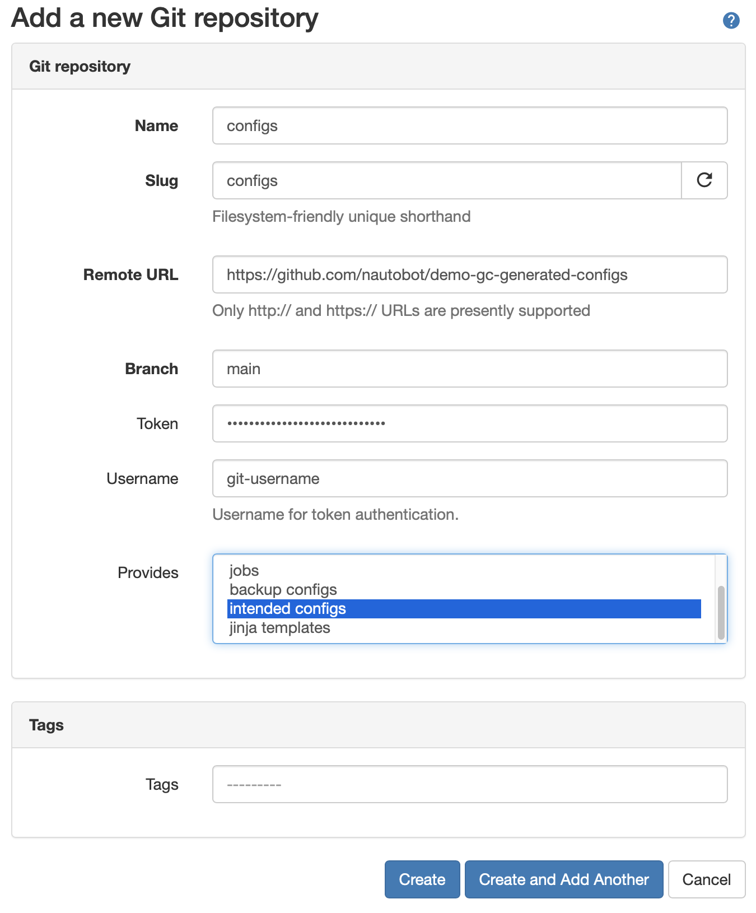
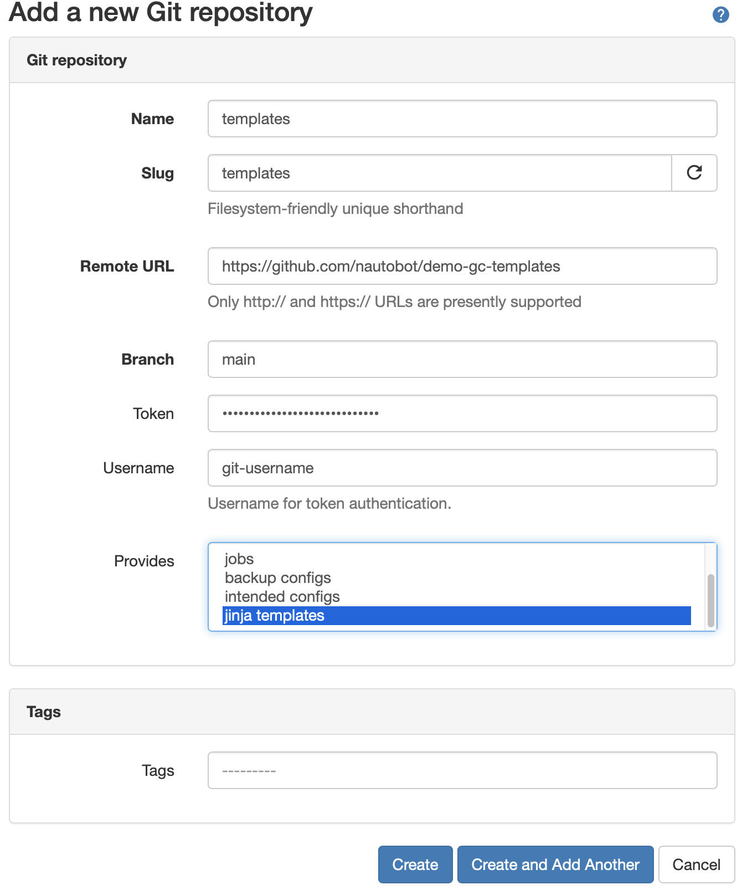

# Configuration Generation

The Golden Config plugin provides the ability to generate configurations. The process is a Nornir play that points to a single Jinja template per 
device that generates the configurations. Data is provided via the Source of Truth aggregation and is currently a hard requirement to be turned on if 
generating configuration via the Golden Config plugin. Whatever data is returned by the Source of Truth Aggregation is available to the Jinja template.

As previous stated, there can only be a single template per device. It is often advantageous to break configurations into smaller snippets. A common pattern 
to overcome is:

```jinja
!

!

!

!
```
or 

```jinja
!



!

```

## Intended Configuration Settings

In order to generate the intended configurations two repositories are needed.

1. A repo to save intended configurations to once generated. [See](#Configs-Repository)
2. A repo that stores Jinja2 templates used to generate intended configurations. [See](#Templates-Repository)
3. The [intended_path_template](./golden-config-settings.md#Intended-Path) configuration parameter.
4. The [jinja_path_template](./golden-config-settings.md#Template-Path) configuration parameter.

### Configs Repository
The first step is to go to Nautobot and navigate to the Data Sources Git integration. `Extensibility -> Git Repositories`.


From the Git Repositories page we an add the **configs** repository.

Click on `[+ADD]`.

You will now be presented with a page to fill in the repository details.

Parameters:
|Field|Explanation|
|:--|:--|
|Name|User friendly name for the backup repo.|
|Slug|Auto-generated based on the `name` provided.|
|Remote URL|The URL pointing to the Git repo that stores the backup configuration files. Current git url usage is limited to `http` or `https`.|
|Branch|The branch in the Git repo to use. Defaults to `main`.|
|Token|The token is a personal access token for the `username` provided.  For more information on generating a personal access token. [Github Personal Access Token](https://docs.github.com/en/github/authenticating-to-github/creating-a-personal-access-token)
|Username|The Git username that corresponds with the personal access token above.|
|Provides|Valid providers for Git Repo.|
<br>



Select `backup configs` and click on `[Create]`.

Once you click `[Create]` and the repository syncs, the main page will now show the repo along with its status.

### Templates Repository
Navigate back to Git Repositories and click `[+ADD]`.  Fill out the form with the repo that holds the Jinja2 templates.



Select `jinja templates` and click on `[Create]`.
