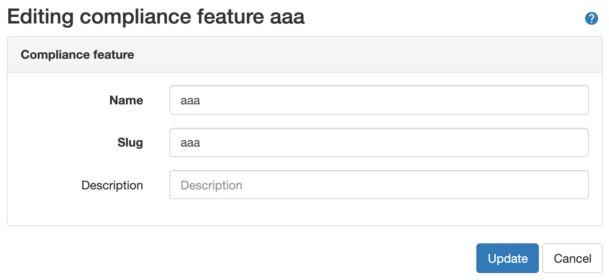
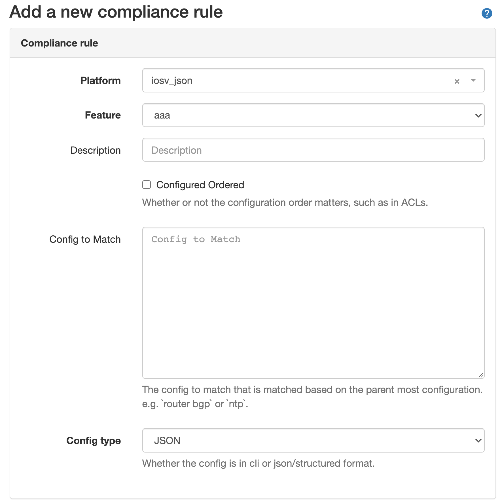
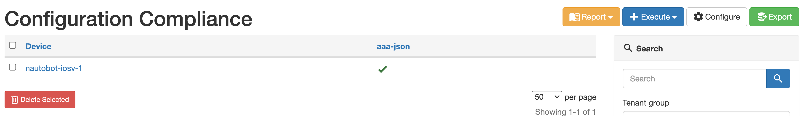
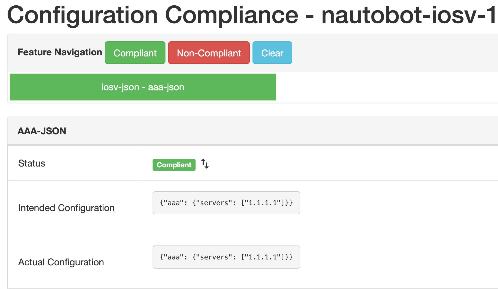
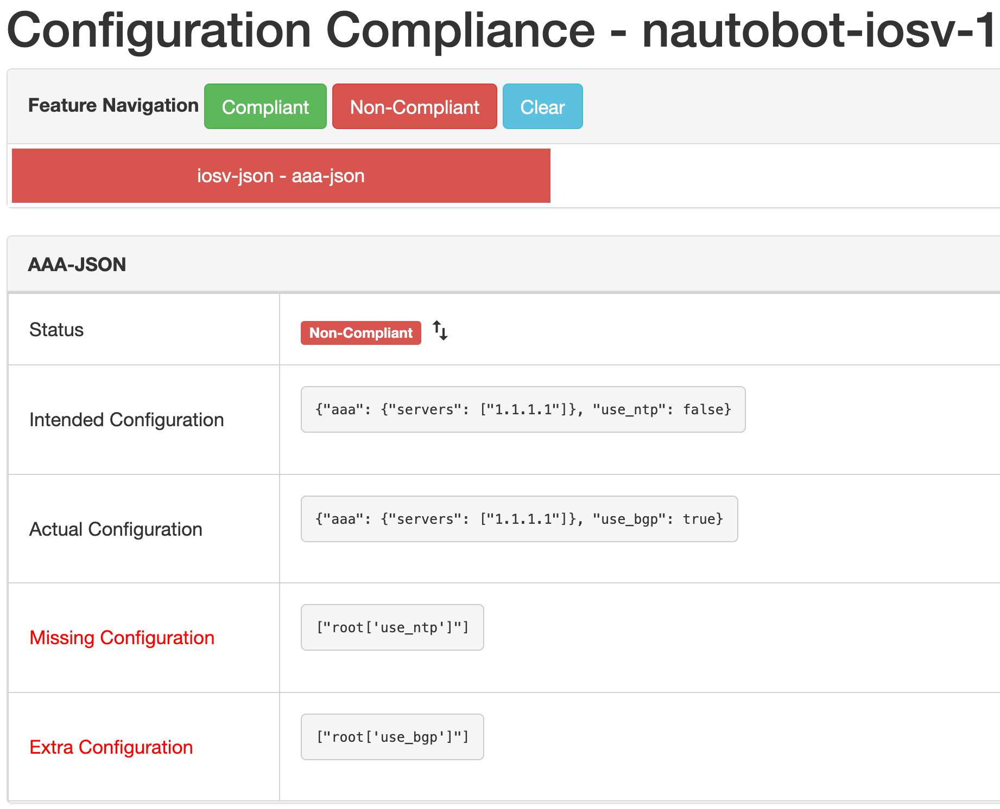
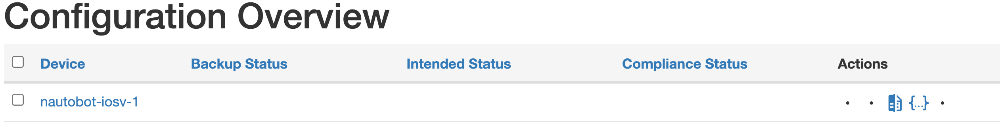
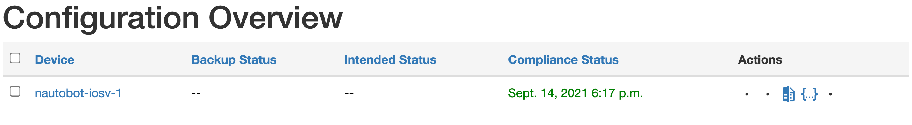
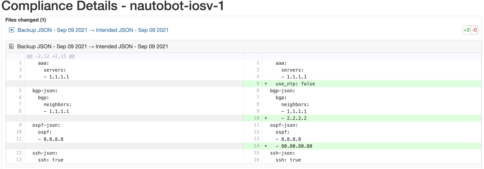

# Navigating Compliance Using Structured Data

JSON based compliance provides a mechanism to understand device configurations stored in JSON format and compare between them.

## Caveats

- The `Compliance Rule` need to be defined as JSON `config-type`.
- When creating `Compliance Rules` with the config type of JSON, the `config to match` field is used to specify individual top-level JSON keys, or it can be left blank to compare all keys.
- Uses Git repositories for backup and intended configurations.

## Quick Start Guide

1. First, the compliance feature needs to be created, the feature name needs to be unique for a Platform and can not be shared between CLI and JSON types.

    

1. Link the feature that was just created to a rule definition.

    

1. Now that the definitions are created and the rule is created and mapped to a Platform, execute compliance job under Jobs.

1. Verify the compliance results

In the navigation menu: `Golden Config -> Configuration Compliance`.

With the detailed view:

Example of a Non-Compliant rule:

Seeing the diff button alone will **only** show up for devices using JSON compliance rules.

The detailed diff view will show a side by side diff, this looks the same as the CLI view.

