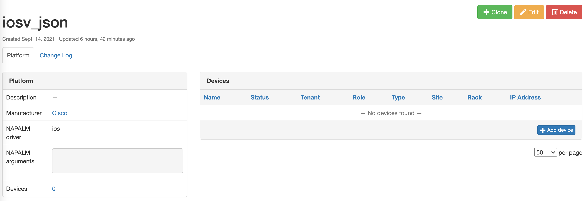

# Navigating Compliance Using Structured Data

!!! warning
    This feature is in early development and is only implemented within the API.  There are multiple caveats that need to be considered and they are listed below.

## Caveats
- Must have a `Platform` created specifically for the feature.
- The compliance `rule` need to be unique for the JSON `config-type`.
- When creating `Compliance Rules` with the config type of JSON, the `config to match` field is not used it should be left blank.
- Does **NOT** use Git repositories for backup and intended configurations.
- Mixing/Matching CLI and JSON compliance rules is **NOT** supported.  A device should only have compliance rules from one or the other, and it is up to the operator to enforce.

## Quick Start Guide

1. To get started with the structured data(JSON) compliance check the first step is to create a platform.



2. Next, the compliance feature needs to be created, the feature can be shared between a CLI rule and a JSON rule.


3. Link the feature that was just created to a rule definition.


4. Now that the definitions are created and the rule is mapped to the platform we created the API execution can be performed.

Here is an example of a `POST` to the `/plugins​/golden-config​/config-compliance​/` endpoint.

```json
{
  "actual": {"aaa": {"servers": ["1.1.1.1"]}},
  "intended": {"aaa": {"servers": ["1.1.1.1"]}},
  "device": "472c3786-4499-4e34-8d8e-291c4c7f32a9",
  "rule": "87cc003b-9025-472d-bf3c-e5b62bf91987"
}
```

!!! note
    The UUID is needed for the device and rule to execute against.  This data can be found in the UI or by querying the proper endpoints, `/plugins/golden-config/compliance-rule/` and `/dcim​/devices​/`.

Once the API call is made the response data provides a quick snapshot.
```json
{
  "id": "be35a701-0cb0-418a-98e7-a82d99db857e",
  "device": "472c3786-4499-4e34-8d8e-291c4c7f32a9",
  "rule": "87cc003b-9025-472d-bf3c-e5b62bf91987",
  "actual": {"aaa": {"servers": ["1.1.1.1"]}},
  "intended": {"aaa": {"servers": ["1.1.1.1"]}},
  "ordered": true,
  "compliance": true,
  "display": "nautobot-iosv-1 -> iosv-json - aaa-json -> True"
}
```

You can also see the compliance data in the UI once it is created via API.

In the navigation menu: `Golden Config -> Configuration Compliance`.


With the detailed view:


Example of a Non-Compliant rule:


!!! note
    All subsequent updates to the compliance rule need to use the `PUT` or `PATCH` API methods and they need to provide the UUID that was created for the specific compliance execution. This UUID is generated by (unique_together = ("device", "rule"))


Seeing the diff button alone will **only** show up for devices using JSON compliance rules.


The detailed diff view will show a side by side diff, this looks the same as the CLI view.


