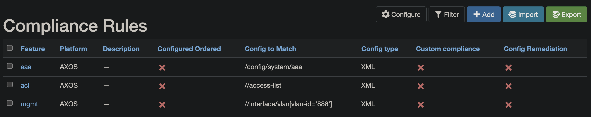
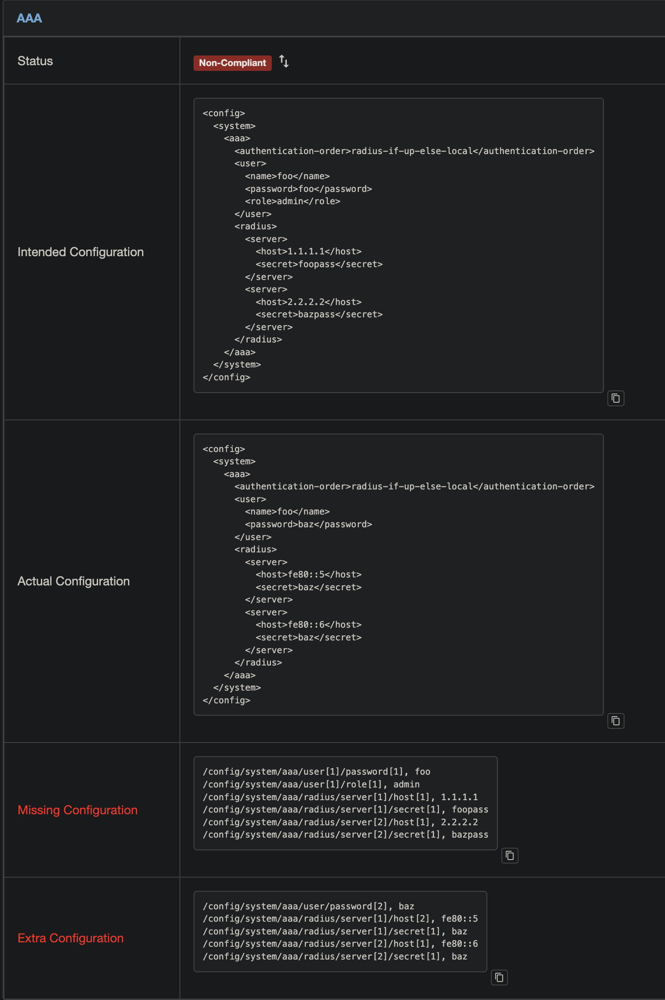

# Navigating Compliance Using XML

XML based compliance provides a mechanism to compliance check device configurations stored in XML format.

## Defining Compliance Rules

Compliance rules are defined as XML `config-type`.

The `config to match` field is used to specify an XPath query. This query is used to select specific nodes in the XML configurations for comparison. If the `config to match` field is left blank, all nodes in the configurations will be compared.

### XPath in Config to Match

XPath (XML Path Language) is a query language for selecting nodes from an XML document. In our application, XPath is used in the `config to match` field to specify which parts of the device configurations should be compared.

### Basic XPath Syntax

Here is a quick reference for basic XPath syntax:

| Expression | Description |
| --- | --- |
| `nodename` | Selects all nodes with the name "nodename" |
| `/` | Selects from the root node |
| `//` | Selects nodes in the document from the current node that match the selection no matter where they are |

For more detailed information on XPath syntax, you can refer to the [Supported XPath syntax](https://docs.python.org/3/library/xml.etree.elementtree.html#supported-xpath-syntax).

This NTC [blog](https://blog.networktocode.com/post/parsing-xml-with-python-and-ansible/) also covers XPath in more details.

Here are some examples of XPath queries that can be used in the `config to match` field:



## Device Config Compliance View



## Interpreting Diff Output

The diff output shows the differences between the device configurations. Each line in the diff output represents a node in the XML configurations. The node is identified by its XPath, and the value of the node is shown after the comma.

Here's a sample 'missing' output:

```text
/config/system/aaa/user[1]/password[1], foo
/config/system/aaa/user[1]/role[1], admin
/config/system/aaa/radius/server[1]/host[1], 1.1.1.1
/config/system/aaa/radius/server[1]/secret[1], foopass
/config/system/aaa/radius/server[2]/host[1], 2.2.2.2
/config/system/aaa/radius/server[2]/secret[1], bazpass
```

This diff output represents the 'missing' portion when comparing the actual configuration to the intended configuration. Each line represents a node in the XML configuration that is presented in the intended configuration but is missing in the actual configuration.

For example, the line `/config/system/aaa/user[1]/password[1], foo` indicates that the password node of the first user node under `/config/system/aaa` is expected to have a value of `foo` in the actual configuration. If this line appears in the diff output, it means this value is missing in the actual configuration.
