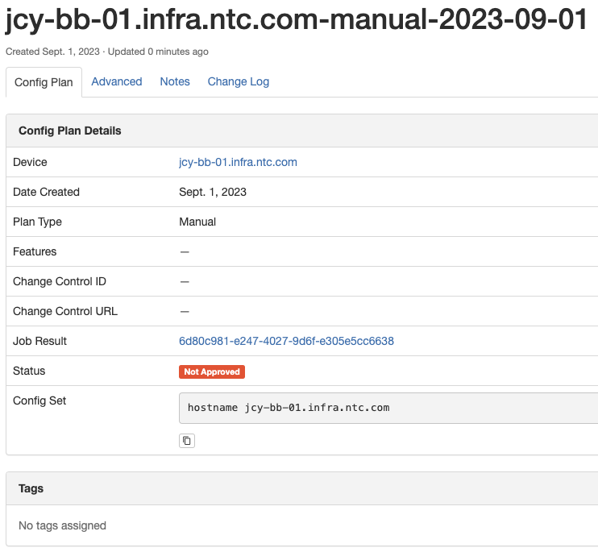
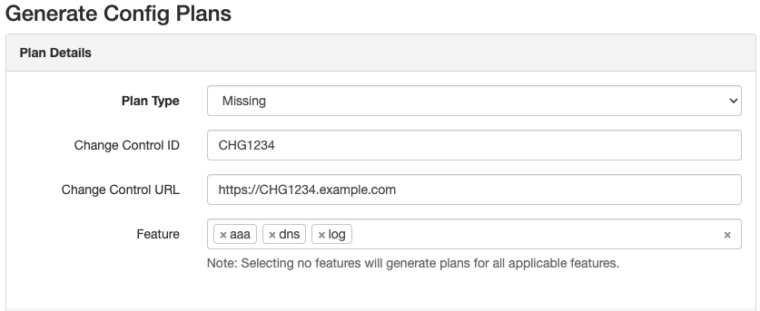
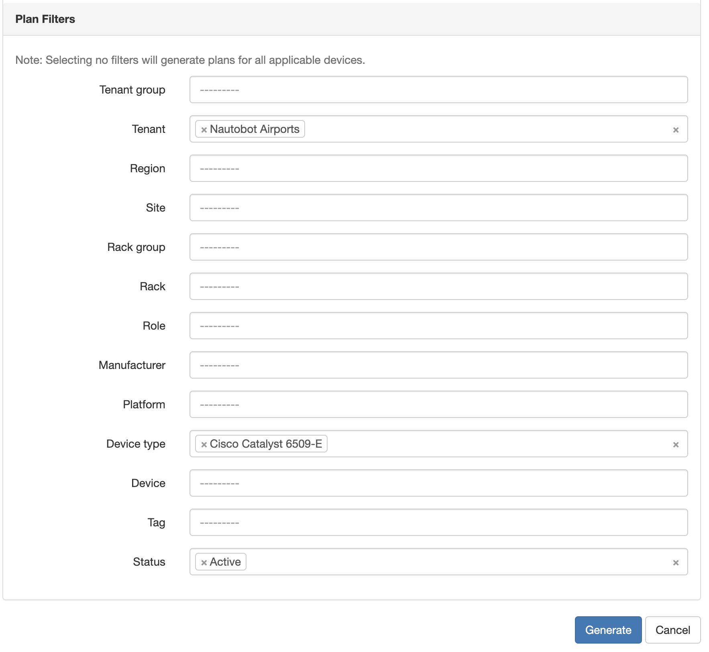
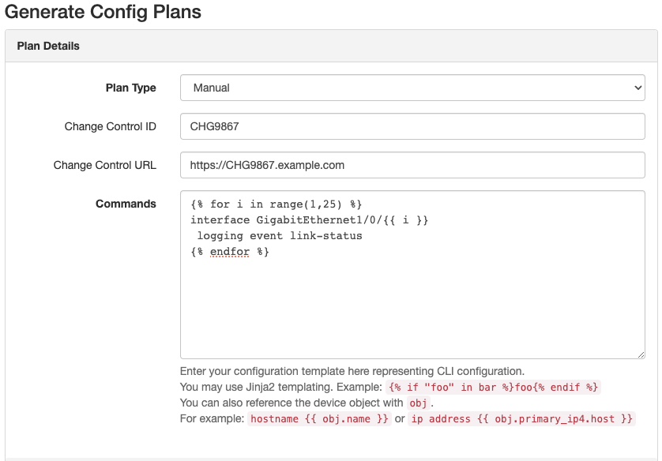
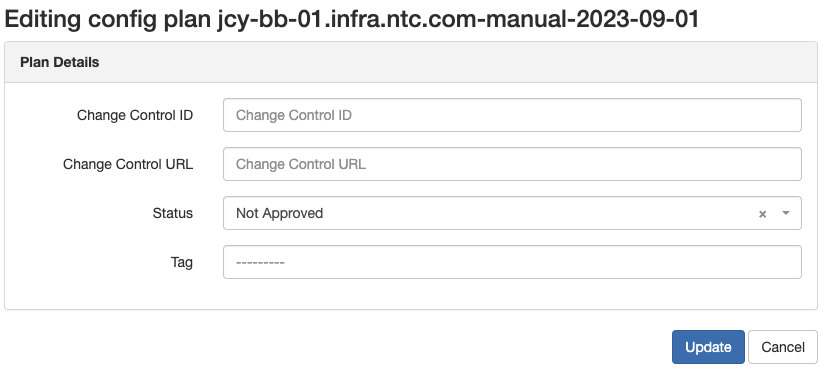

# Navigating Config Plans

The natural progression for the Golden Config application is providing the ability to execute config deployments. One specific example is to work toward making one or more devices configuration compliant. To aid in this effort, the Golden Config application has the ability to generate plans containing sets of configuration commands from various sources with the intent of deploying them to devices.

The current sources of these plans (i.e. plan types) are as follows:

- The **Intended** configuration of a specific Compliance Feature
- The **Missing** configuration(s) of Compliance Feature(s)
- The **Remediation** configuration(s) of Compliance Feature(s) (*)
- A **Manual** set of configuration commands

!!! note
    The Intended, Missing and Remediation configuration come from the [Configuration Compliance](./app_feature_compliance.md#compliance-details-view) object that is created when you run the [Perform Configuration Compliance Job](./app_feature_compliance.md#starting-a-compliance-job).

Much like a Configuration Compliance object, each Config Plan is tied directly to a single Device.

## Viewing a Config Plan

You can view a plan by navigating to **Golden Config -> Config Plans** and choosing a generated plan from the list. A Config Plan comprises of the following fields:

- **Device**: The device the plan is to be deployed to.
- **Date Created**: The date the plan was generated.
- **Plan Type**: The type of plan used to generate it.
- **Config Set**: The set of commands to be deployed.
- **Feature** (If Applicable): The Compliance Feature the config set was generated from.
- **Change Control ID** (Optional): A text field that be used for grouping and filtering plans.
- **Change Control URL** (Optional): A URL field that can be used to link to an external system tracking change controls.
- **Status**: The status of the plan.

## Generating Config Plans

In order to generate a plan, navigate to **Golden Config -> Config Plans** and hit the **Add** button. After choosing the type of plan you want to generate, you can then filter the list of devices you want to generate a Config Plan for by selecting either the list of devices themselves or a by choosing one or more related items such as Location or Status. If you select a plan type that is derived from a Configuration Compliance object, you will have the ability to only generate plans for one or more features, but selecting no features will generate plans for all applicable features.

In addition, you have the ability to specify a Change Control ID that can be associated with all of the plans that will be generated. This can come in handy when it comes to filtering the list of plans to ultimately deploy.

Once you have selected the appropriate options, you can click the **Generate** button which will start a Job to generate the plans. You will automatically be forwarded to the Job Result output page so you can monitor the progress.

### Screenshots

### Generating Config Plans via API

The HTTP(S) POST method is not currently enabled for the Config Plan serializer to create plans directly via API. Instead you may run the **GenerateConfigPlans** Job directly via the `plugins/nautobot_golden_config.jobs/GenerateConfigPlans` API endpoint.

## Editing a Config Plan

After a Config Plan is generated you have the ability to edit (or bulk edit) the following fields:

- Change Control ID
- Change Control URL
- Status
- Notes
- Tags

!!! note
    You will not be able to modify the Config Set after generation. If it does not contain the desired commands, you will need to delete the plan and recreate it after ensuring the source of the generated commands has been updated.

