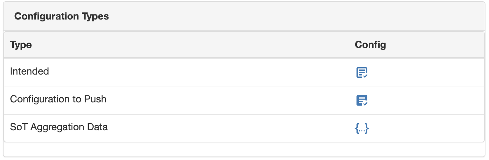

# Navigating Configuration Post-processing

!!! note
    Current implementation **only renders the configuration to push, it doesn't update the configuration** into the target devices.

The intended configuration job doesn't produce a final configuration artifact (see below for reasons why). The intended configuration is the "intended" **running** configuration, because the intended configuration job generates what is in the final running configuration. This works well for the "compliance" feature, but not as well to create a configuration artifact that is ready to push.

Challenging use cases when using the running configuration as intended:

- Because the intended configuration is stored in the database, and in an external Git repository, it should **not** contain any secret.
- The format of the running configuration is not always the same as the configuration to push, examples include:
    - Pushing SNMPv3 configurations, which do not show up in the running config
    - VTP configurations where the configurations is not in the running config at all
    - Implicit configurations like a "no shutdown" on an interface
- The configurations used to get the configuration to the intended state may require to be ordered to not cause an outage.

As the Golden Config application becomes more mature in delivering an all encompassing configuration management solution, it requires an advanced feature to render a configuration artifact. That artifact must be in the final format your device is expecting, from the intended configuration.

This is exposed via the `get_config_postprocessing()` function defined in `nautobot_golden_config.utilities.config_postprocessing`. This method takes the current configurations generated by the Golden Config intended configuration feature, and the HTTP request. This function will return the intended configuration that is **ready to push**.

From the user perspective, you can retrieve this configuration via two methods:

- UI: within the `Device` detail view, if the feature is enabled, a new row in the "Configuration Types" appears, and clicking the icon the new configuration will be rendered on the fly (synchronously). Check figure.
- REST API: at the path `/api/plugins/golden-config/config-postprocessing/{device_id}` you can request the intended configuration processed, and the return payload will contain a "config" key with the rendered configuration.



## Customize Configuration Processing

There are two different ways to customize the default behavior of `get_config_postprocessing` method:

- `postprocessing_callables`: is the list of **available methods** for processing the intended configuration. It contains some default implemented methods, currently `render_secrets`. But it could be extended via configuration options (see next section). The format for defining these methods is via the dotted string format that will be imported by Django. For example, the `render_secrets` is defined as `"nautobot_golden_config.utilities.config_postprocessing.render_secrets"`.
- `postprocessing_subscribed`: is the list of **methods names** (strings) that define the **order** in the processing chain. The defined methods MUST exist in the `postprocessing_callables` list. This list can be customized via configuration options, and eventually, it could be extended to accept HTTP query parameters.

## Existing Default Processors

### Render Secrets

The `render_secrets` function performs an extra Jinja rendering on top of an intended configuration, exposing new custom Jinja filters:

- `get_secret_by_secret_group_name`: as the name suggests, it returns the secret_group value, for a secret type, from its `name`.

!!! note
    Other default Django or Netutils filters are not available in this Jinja environment. Only `encrypt_<vendor>_type5` and `encrypt_<vendor>_type7` can be used together with the `get_secret` filters.

Because this rendering is separated from the standard generation of the intended configuration, you must use the `` Jinja syntax to avoid being processed by the initial generation stage.

1. For example, an original template like this, `ppp pap sent-username {{ secrets_group["name"] | get_secret_by_secret_group_name("username")}}`
2. Produces an intended configuration as `ppp pap sent-username {{ secrets_group["name"] | get_secret_by_secret_group_name("username") }}`
3. After the `render_secrets`, it becomes `ppp pap sent-username my_username`.

Notice that the `get_secret` filters take arguments. In the example, the `secret_group` name is passed, together with the type of the `Secret`. Check every signature for extra customization.

!!! note
    Remember that to render these secrets, the user requesting it via UI or API, MUST have read permissions to Secrets Groups, Golden Config, and the specific Device object.

#### Render Secrets Example

This shows how Render the Secrets feature for a `Device`, for the default `Secrets Group` FK, and for custom relationships, in the example, at `Location` level.

##### GraphQL query

```graphql
query ($device_id: ID!) {
  device(id: $device_id) {
    secrets_group {
      name
    }
    location {
      rel_my_secret_relationship_for_location {
        name
      }
    }
  }
}
```

##### Jinja Template

Using the default `secrets_group` FK in `Device`:

```jinja2
{{ secrets_group["name"] | get_secret_by_secret_group_name("password") | default('no password') }}
```

Using the custom relationship at the `Location` level:

```jinja2
{{ location["rel_my_secret_relationship_for_location"][0]["name"] | get_secret_by_secret_group_name("password") | default('no password') }}
```

This will end up rendering the secret, of type "password", for the corresponding `SecretGroup`.

##### Managing errors

Obviously, the rendering process can find multiple challenges, that are managed, and properly explained to take corrective actions:

```
Found an error rendering the configuration to push: Jinja encountered and UndefinedError: 'None' has no attribute 'name', check the template for missing variable definitions.
```
