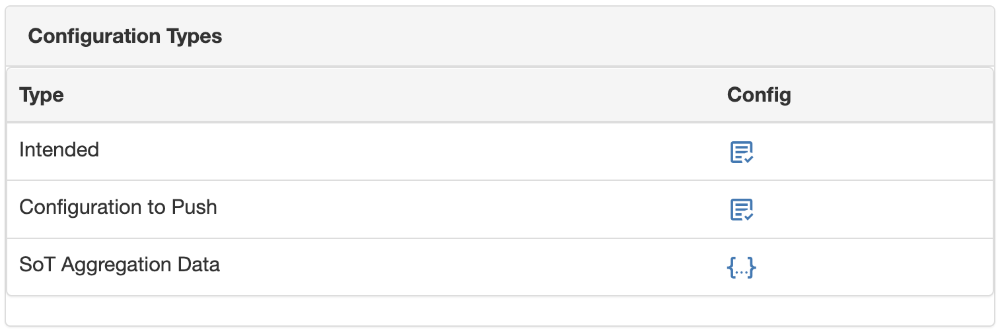

# Configuration to Push

!!! note
    current implementation **only renders the configuration to push, it doesn't update the configuration** into the target devices.

The Intended Configuration Job doesn't pretend to produce a final configuration artifact, ready to use to update a network device configuration state(see below for reasons why). Actually, you should understand it as the "intended" **running** configuration, because the intended configuration job generates what is in the final running configuration. This works well for the "compliance" feature, but not to create a ready to push configuration artifact.

Some well-known limitations on the intended configuration generated by the intended feature are:

- Because the intended configuration is stored in the Database, and in an external Git repository, it SHOULD NOT contain any secret (or derivative).
- The format of the running configuration is not always the same as the configuration to push, examples include:
  - Pushing snmpv3 configurations
  - VTP configurations
  - Implicit configurations like a "no shutdown" on an interface

However, Golden Config intending to become an all encompassing configuration management application, is providing an advanced feature to render a configuration artifact, in the final format your device is expecting, from the intended configuration.

This is exposed via the `get_config_to_push()` function in `nautobot_golden_config.utilities.config_to_push`. This method takes as input the current configurations generated available to Golden Config, and the HTTP request, in order to process the intended configuration, and return the intended configuration **ready to push**.

From user perspective, you can retrieve this configuration via two methods:

- UI: within the `Device` detail view, if the feature is enabled, a new row in the "Configuration Types" appears, and clicking the icon the new configuration will be rendered on the fly (synchronously). Check figure.
- REST API: at the path `/api/plugins/golden-config/config-to-push/{device_id}` you can request the intended configuration processed, and the return payload will contain a "config" key with the rendered configuration.



## Customize Configuration processing

There are two different ways to customize the default behavior of `get_config_to_push` method:

- `config_push_callable`: is the list of **available methods** to for processing the intended configuration. It contains some default implemented methods, currently `render_secrets`. But it could be extended via configuration options (see next section).
- `config_push_subscribed`: is the list of **methods names** (strings) that define the **order** in the processing chain. The defined methods MUST exist in the `config_push_callable` list. This list can be customized via configuration options, and eventually, it could be extended to accept HTTP query parameters.

## Existing Default Processors

### Render Secrets

The `render_secrets` function performs an extra Jinja rendering on top of an intended configuration, exposing new custom Jinja filters:

- `get_secret_by_secret_group_slug`: as the name suggests, it returns the secret_group value, for a secret type, from its `slug`.

!!! note
    Other default Django or Netutils filters are not available in this Jinja environment. Only `encrypt_type5` and `encrypt_type7` can be used together with the `get_secret` filters.

Because this rendering happens not in the first one done to generate the intended configuration, but on a second one, you must use the `` Jinja syntax to avoid being processed on the first one.

1. For example, an original template like this, `ppp pap sent-username {{ secrets_group["slug"] | get_secret_by_secret_group_slug("username")}}`
2. Produces an intended configuration as `ppp pap sent-username {{ secrets_group["slug"] | get_secret_by_secret_group_slug("username") }}`
3. After the `render_secrets`, it becomes `ppp pap sent-username my_username`.

Notice that the `get_secret` filters take arguments. In the example, the `Secret_group` slug is passed, together with the type of the `Secret`. Check every signature for extra customization.

!!! note
    Remember that to render these secrets, the user requesting it via UI or API, MUST have read permissions to Secrets Groups, Golden Config, and the specific Device object.

#### Render Secrets Example

This shows how to the Render Secrets feature for a `Device`, for the default `Secrets Group` FK, and for custom relationships, in the example, at `Site` level.

##### GraphQL query

```graphql
query ($device_id: ID!) {
  device(id: $device_id) {
    secrets_group {
      slug
    }
    site {
      rel_my_secret_relationship_for_site {
        slug
      }
    }
  }
}
```

##### Jinja Template

Using the default `secrets_group` FK in `Device`:

```jinja2
{{ secrets_group["slug"] | get_secret_by_secret_group_slug("password") | default('no password') }}
```

Using the custom relationship at the `Site` level:

```jinja2
{{ site["rel_my_secret_relationship_for_site"][0]["slug"] | get_secret_by_secret_group_slug("password") | default('no password') }}
```

This will end up rendering the secret, of type "password", for the corresponding `SecretGroup`.

##### Managing errors

Obviously, the rendering process can find multiple challenges, that are managed, and properly explained to take corrective actions:

```
Found an error rendering the configuration to push: Jinja encountered and UndefinedError: 'None' has no attribute 'slug', check the template for missing variable definitions.
```
