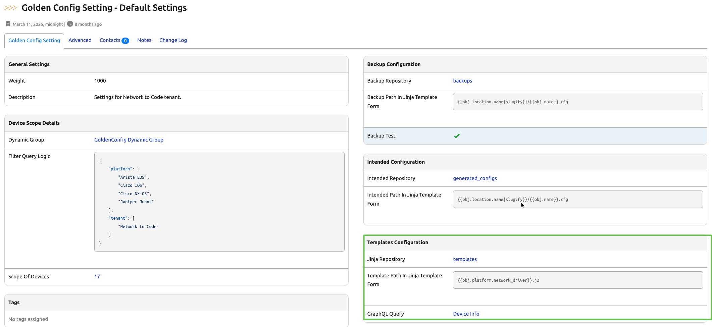

# Intended Configuration

## Configuration Generation

The Golden Config app **Intended Configuration** job generates intended state files for each device in the app setting's configured Dynamic Group. An intended state files contain the output from rendering the device's Source of Truth Aggregation values through the Jinja2 templates used by the app.

The job itself is a Nornir play which uses a single Jinja2 template per device. Source of Truth Aggregation data comes from the GraphQL query configured in the Golden Config app's settings. An important component of the SoT Aggregation data are the `config_context` values. `config_context` should contain a vendor-neutral, JSON structured representation of a device's configuration values: a list of NTP/AAA/Syslog servers, common VRFs, etc. See [Config Contexts](https://docs.nautobot.com/projects/core/en/latest/additional-features/config-contexts/#configuration-contexts) for more information.

The Source of Truth Aggregation feature of the app must be enabled for the app to generate intended configuration state output.

There can only be a single Jinja2 template per device. Device configurations can become daunting to create via a template, if you try to place all of the logic for a device's configuration inside a single Jinja2 file. These template files can quickly become too complex to maintain. So, it is often advantageous to break configurations into smaller feature-oriented snippets, each contained in their own discrete template file. Operators often keep their main, top-level, template simple and easy to maintain by only placing include statements in it:

```jinja
!

!

!

!
```

or

```jinja
!



!

```

??? example "Demo Instance Methodology"
    ## Demo Instance

    This is how the [demo instance](https://demo.nautobot.com) of Nautobot handles the configuration of Golden Config. This may be one recommended method for you to set up Golden Configuration. In the configuration of [Golden Config settings](https://demo.nautobot.com/plugins/golden-config/golden-config-setting/c5c257d0-906d-4790-9e80-030d8231b738/?tab=main) which you get to by navigating to the top menu, expanding **Golden Config**, selecting **Golden Config Settings**. Then select the **Default Settings** option. You now see all of the options that are used to configure the application. Then on the right hand side in the **Templates Configuration** section you can set the entrypoint of the generating the configuration. This instance uses `{{obj.platform.network_driver}}.j2`. `obj` refers to the Device you are using. `platform` is the platform associated with the device. And `network_driver` refers to the setting of the network driver. 

    

    The actual jinja2 file can then be found within the [Git repository for the templates](https://github.com/nautobot/demo-gc-templates).

In these examples, `/services.j2`, `/ntp.j2`, etc. could contain the actual Jinja code which renders the configuration for their corresponding features. Alternately, in more complex environments, these files could themselves contain only include statements in order to create a hierarchy of template files so as to keep each individual file neat and simple. Think of the main, top-level, template as an entrypoint into a hierarchy of templates. A well thought out structure to your templates is necessary to avoid the temptation to place all logic into a small number of templates. Like any code, Jinja2 functions become harder to manage, more buggy, and more fragile as you add complexity, so any thing which you can do to keep them simple will help your automation efforts.

### Developing Intended Configuration Templates

To generate a device's intended configuration without running a full "intended configuration" job, Golden Config provides a simple web UI at `/plugins/golden-config/generate-intended-config/` and a REST API at `/api/plugins/golden-config/generate-intended-config/`. 

Note that this tool is only intended to render Jinja2 templates and does not apply any [configuration post-processing](./app_feature_config_postprocessing.md).

Using this tool to render a configuration will automatically retrieve the latest commit from the Jinja2 templates Git repository before rendering the template.

#### Web UI

The web UI provides a user-friendly form to interact with the rendering process. You can access the web UI by clicking on "Generate Intended Config" in the "Tools" section of the Golden Config navigation menu.

For more advanced use cases, the form accepts an optional "GraphQL Query" to specify a custom GraphQL query to use when rendering the configuration. If a "GraphQL Query" is not provided, the default query configured in the Device's Golden Config settings will be used.

Starting in Nautobot v2.4.2, this UI also allows you to supply a "Git Repository Branch" to specify the branch of the Jinja2 templates Git repository to use when rendering the configuration. If the branch is not provided, the configured branch of the Golden Config Setting's Jinja template Git repository will be used.


#### REST API

The REST API accepts query parameters for `device_id`, an optional `graphql_query_id` and an optional `branch` if running Nautobot v2.4.2 or later.

Here's an example of how to request the rendered configuration for a device using the REST API:

```no-highlight
curl -s -X GET \
    -H "Accept: application/json" \
    http://nautobot/api/plugins/golden-config/generate-intended-config/?device_id=231b8765-054d-4abe-bdbf-cd60e049cd8d
```

The returned response will contain the rendered configuration for the specified device, the GraphQL data that was used, and if applicable, a diff of the most recent intended config that was generated by the **Intended Configuration** job.

## Adding Jinja2 Filters to the Environment.

This app follows [Nautobot](https://docs.nautobot.com/projects/core/en/stable/plugins/development/#including-jinja2-filters) in relying on [django_jinja](https://niwinz.github.io/django-jinja/latest/) for customizing the Jinja2 Environment. Currently, only filters in the `django_jinja` Environment are passed along to the Jinja2 Template Environment used by Nornir to render the config template.

### Adding Filters In Nautobot Config

Nautobot documents using the `@django_jinja.library.filter` decorator to register functions as filters with `django_jinja`. However, users of apps are not able to define apps in the specified jinja2 filter file that is loaded into the Jinja2 Environment.

There are several alternative ways to have functions registered as filters in the `django_jinja` environment; below demonstrates defining decorated functions in a separate file, and then importing them in the `nautobot_config.py` file. This method requires that the file is in a path that is available to Nautobot's python environment.

!!! note
    `django_jinja` documents adding filters in the `TEMPLATES` config section; since Nautobot sets the `TEMPLATES` config section and does not document this in optional settings, it is recommended to only use the `@django_jinja.library.filter` decorator.

#### custom_jinja_filters/config_templates.py

```python
import ipaddress

from django_jinja import library


@library.filter
def get_hostmask(address):
    ip_address = ipaddress.ip_network(address)
    return str(ip_address.hostmask)


@library.filter
def get_netmask(address):
    ip_address = ipaddress.ip_network(address)
    return str(ip_address.netmask)
```

#### nautobot_config.py

```python
...
# custom_jinja_filters must be in nautobot's python path
from custom_jinja_filters import config_templates
...
```

## Starting a Intended Configuration Job

To start a intended configuration job manually:

1. Navigate to `Golden Config -> Config Overview`, with Home being in the `Golden Configuration` section
2. Select _Execute_ on the upper right buttons, then _Intended_
3. Fill in the data that you wish to have configurations generated for up
4. Select _Run Job_

## Intended Configuration Settings

In order to generate the intended configurations at least two repositories are needed.

1. At least one repository in which to save [intended configurations](./app_use_cases.md#git-settings) once generated.
2. At least one repository in which to store device [backups](./app_use_cases.md#git-settings); the device's current operating configuration.
3. The [intended_path_template](./app_use_cases.md#application-settings) configuration parameter.
4. The [jinja_path_template](./app_use_cases.md#application-settings) configuration parameter.

## Data

The data provided while rendering the configuration of a device is described in the [SoT Aggregation](./app_feature_sotagg.md) overview.
