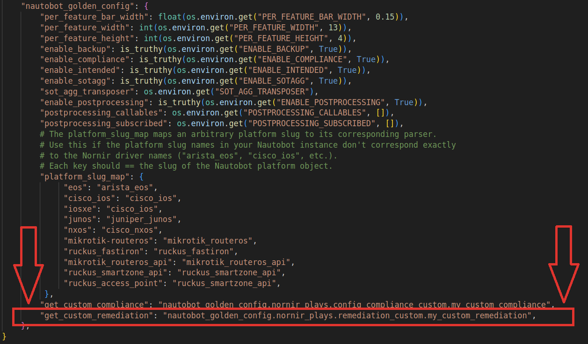

# Navigating Configuration Remediation

Automated network configuration remediation is a systematic approach that leverages technology and processes to address and rectify configuration issues in network devices. 
It involves the use of the Golden Configuration app to understand the current configuration state, compare it against the intended configuration state, and automatically generate remediation data.
Automated network configuration remediation improves efficiency by eliminating manual efforts and reducing the risk of human errors. It enables rapid response to security vulnerabilities, minimizes downtime, and enhances compliance with regulatory and industry standards.

The current sources of data to generate remediating configuration are as follows:

- The **Intended** configuration of a specific Compliance Feature
- The **Missing** configuration of a specific Compliance Feature
- The **Extra** configuration of a specific Compliance Feature

Based on this information, Golden Configuration will create a remediating configuration (if enabled for that particular platform and compliance feature). This configuration snippet will be represented as a "Remediating Configuration" field in the compliance detailed view:

- The **Remediation** configuration of a specific Compliance Feature

!!! note
    The Intended, Missing and Extra configuration come from the [Configuration Compliance](./app_feature_compliance.md#compliance-details-view) object that is created when you run the [Perform Configuration Compliance Job](./app_feature_compliance.md#starting-a-compliance-job).

## Setting up Configuration Remediation

The type of remediation to be performed in a particular platform is defined by navigating to **Golden Config -> Remediation Settings**.
Network device operating systems (Nautobot Platforms) can consume two different types of remediation, namely:

- **HIERCONFIG remediation (CLI - hierarchical)**
- **Custom Remediation**

{ .on-glb }
{ .on-glb }

### Hier Config Remediation Type

Hier Config is a python library that is able to take a running configuration of a network device, compare it to its intended configuration, and build the remediation steps necessary to bring a device into spec with its intended configuration. Hier Config has been used extensively on:

- Cisco IOS
- Cisco IOSXR
- Cisco NXOS
- Arista EOS
- Ruckus FastIron

However, any Network Operating System (NOS) that utilizes a CLI syntax that is structured in a similar fashion to Cisco IOS should work mostly out of the box.
Default Hier config options can be used or customized on a per platform basis, as shown below:

{ .on-glb }
{ .on-glb }

For additional information on how to customize Hier Config options, please refer to the Hierarchical Configuration development guide:
https://hier-config.readthedocs.io/en/latest/

### Custom Config Remediation Type

When a Network Operating System delivers configuration data in a format that is not CLI/Hierarchical, we can still perform remediation by using the Custom Remediation options. Custom Remediation is defined within a Python function that takes as input a Configuration Compliance object and returns a Remediation Field.
Custom remediation performs a call to the remediation function every time a Compliance Job runs. Custom Remediation allows the user to control the configuration comparison process (between intended and actual configuration) and use additional Nautobot or external data to produce the remediation plan. Custom remediation functions need to be defined in PLUGIN_CONFIG for `nautobot_plugin_golden_config` the nautobot_config.py file, as show below:

{ .on-glb }

## Enabling Configuration Remediation

Once remediation settings are configured for a particular platform, remediation can be enabled on a per compliance rule basis. In order to enable configuration remediation for a particular rule, navigate to **Golden Config -> Compliance Rules**, and choose a rule for a platform that has remediation settings set up. Edit the compliance rule and check the box "Enable Remediation". This action effectively enables remediation for that particular Platform/Feature pair.

{ .on-glb }
{ .on-glb }

## Validating Configuration Remediation

Once remediation is configured for a particular Platform/Feature pair, it is possible to validate remediation operations by running a compliance job. Navigate to **Jobs -> Perform Configuration Compliance** and run a compliance job for a device that has remediation enabled. Verify that remediation data has been generated by navigating to **Golden Config -> Config Compliance**, select the device and check the compliance status for the feature with remediation enabled and the "Remediating Configuration" field, as shown below:

{ .on-glb }
{ .on-glb }