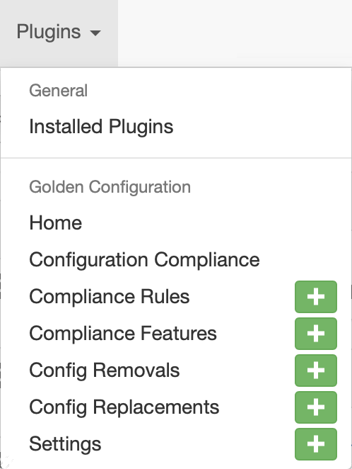
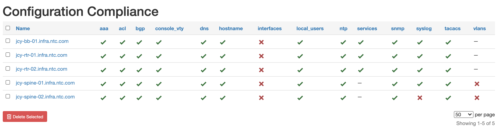
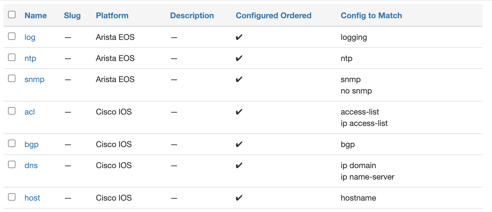

# Using the App

## General Usage

### Home

The Home view is a portal to understand what the status of the devices are.


Some of the information described in this view, may not be immediately obvious.

* The Backup/Intended/Compliance status will always show the last time the job was successfully ran for that device, but there are several conditions it may be in.
  * Green with a date indicates that the ran was successful, which was the last time the job ran.
  * Red with a data indicates the last time the job ran successfully, with the last time the job was attempted in be shown when you mouse over the date.
  * A red double-dashed icon indicated the job has never been successful
* The icons are provided in the following order, that largely matches the status.
  * Backups
  * Intended
  * Unix Diff
  * SoT aggregation data
  * Run job

The first four bring up a "modal" or "dialogue box" which has a detailed view for a dedicated page. The run job brings the user to a job to run all three
components against all of the devices.

### Jobs

There are a series of Jobs that are registered via the Plugin. They can be viewed from the standard Jobs view.


Each Job attempts to provide sane error handling, and respects the `debug` flag to provide more information.


### Application Settings

The golden configuration plugin settings can be found by navigating to `Golden Config -> Settings` button. Select one of the Settings, under the `Golden Configuration` section.
Since Golden Configuration Plugin version 1.0, the plugin allows for multiple settings to be configured by the User.
Each of the settings, has the individual repositories and configuration details, as well as the scope.
You could use a combination of settings to customize Your Configuration Compliance behavior.
Settings have a name and a weight. The weight parameter indicates the priority of given Settings - the higher the weight, the device matching the scope defined will be assigned to the scope.
At the same moment, each device will be matched up to maximum of only one `Settings.` In case of the same weight, the sorting is performed by the name.



To create new settings click on the `+Add` button.
To update existing settings click on one of the `Settings` name.


|Setting|Explanation|
|:--|:--|
|Backup Repositories |The Git Repository where your backup configurations will be found. |
|Backup Path|A Jinja template which defines the path and name of backup files within the backup repository. The variable `obj` is available as the device instance object of a given device, as is the case for all Jinja templates. e.g. `{{obj.site.slug}}/{{obj.name}}.cfg`|
|Intended Repositories |The Git Repository where your intended configuration state files will be found. |
|Intended Path|A Jinja template which defines the path and name of intended configuration state files within the intended state repository. e.g. `{{obj.site.slug}}/{{obj.name}}.intended_cfg`|
|Jinja Repository |The Git Repository where your jinja templates will be found. |
|Jinja Path|A Jinja template which defines the path (within the repository) and name of the Jinja template file. e.g. `{{obj.platform.slug}}/{{obj.role.slug}}/main.j2`|
|Scope|The scope of devices on which Golden Config's jobs can operate. |
|GraphQL Query|A query that is evaluated and used to render the config. The query must start with `query ($device_id: ID!)`.|

!!! note
    Each of these will be further detailed in their respective sections.

#### Scope

The scope, is a JSON blob that describes a filter that will provide the list of devices to be allowed whenever a job is ran. A job can optionally further refine the scope, but the outbound would be based on what is defined here. The options are best described by leveraging the Devices list view, search features (the filtering shown on the side of the Devices.) Building a query there, will provide the exact keys expected.

Filtering to specific platforms, based on their slug.

```json
{
  "platform": [
    "cisco_ios",
    "cisco_nxos",
    "arista_eos",
    "juniper_junos"
  ]
}
```

!!! note
    The Platform slug is an important value, see the [FAQ](./app_faq.md) for further details.

Adding a "has_primary_ip" check.

```json
{
  "platform": [
    "cisco_ios",
    "cisco_nxos",
    "arista_eos",
    "juniper_junos"
  ],
  "has_primary_ip": "True"
}
```

When viewing the settings, the scope of devices is actually a link to the query built in the Devices view. Click that link to understand which devices are permitted by the filter.

### Git Settings

The plugin makes heavy use of the Nautobot git data sources feature. There are up to three repositories used in the application. This set of instructions will walk an operator through setting up the backup repository. The steps are the same, except for the "Provides" field name chosen.

In order to setup this repository, go to Nautobot and navigate to the Data Sources Git integration. `Extensibility -> Git Repositories`.


From the Git Repositories page we can add the **Backup** repository.

Click on `Add`.

You will now be presented with a page to fill in the repository details.

Parameters:

|Field|Explanation|
|:--|:--|
|Name|User friendly name for the backup repo.|
|Slug|Auto-generated based on the `name` provided.|
|Remote URL|The URL pointing to the Git repo that stores the backup configuration files. Current git url usage is limited to `http` or `https`.|
|Branch|The branch in the Git repo to use. Defaults to `main`.|
|Token|The token is a personal access token for the `username` provided.  For more information on generating a personal access token. [Github Personal Access Token](https://docs.github.com/en/github/authenticating-to-github/creating-a-personal-access-token)
|Username|The Git username that corresponds with the personal access token above.|
|Provides|Valid providers for Git Repo.|


!!! note
    If Secret Group is used for the Repositories the secrets type HTTP(S) is required for this plugin.


Select `backup configs` and click on `Create`.

Once you click `Create` and the repository syncs, the main page will now show the repo along with its status.


For their respective features, the "Provides" field could be backup intended configs and jinja templates.

### Plugins Buttons

The plugins buttons provides you with the ability to navigate to Run the script, overview report, and detailed report.

### Run Script

This can be accessed via the Plugins drop-down via `Run Script` button of the `Home` view, the user will be provided a form of the Job (as described
above), which will allow the user to limit the scope of the request.

### Device Template Content

The plugin makes use of template content `right_page` in order to use display in-line the status of that device in the traditional Nautobot view. From here you can click the link to see the detail compliance view.

### Site Template Content

The plugin makes use of template content `right_page` in order to use display in-line the status of that entire site in the traditional Nautobot view.

### API

To run the job programmactially, reference the [nautobot documentation](https://nautobot.readthedocs.io/en/stable/additional-features/jobs/#via-the-api) for the proper API call. Pay special attention to the `class_path` definition.

### Feature Enablement

Enabling features such as backup or compliance, will render those parts of the UI visible. It is worth noting that disabling features does not provide any
garbage collection and it is up to the operator to remove such data.

### Network Operating System Support

The version of OS's supported is documented in the [FAQ](./app_faq.md) and is controlled the platform slug. The platform slug must be exactly as expected or leverage
a configuration option--which is described the the FAQ--for the plugin to work.

### Use-cases and common workflows

This plugin enable four (4) key use cases.

1. **Configuration Backups** - Is a Nornir process to connect to devices, optionally parse out lines/secrets, backup the configuration, and save to a Git repository.
2. **Intended Configuration** - Is a Nornir process to generate configuration based on a Git repo of Jinja files to combine with a GraphQL generated data and a Git repo to store the intended configuration.
3. **Source of Truth Aggregation** - Is a GraphQL query per device that creates a data structure used in the generation of configuration.
4. **Configuration Compliance** - Is a process to run comparison of the actual (via backups) and intended (via Jinja file creation) CLI configurations upon saving the actual and intended configuration. This is started by either a Nornir process for cli-like configurations or calling the API for json-like configurations

!!! warning "Notice"
    The operators of their own Nautobot instance are welcome to use any combination of these features. Though the appearance may seem like they are tightly coupled, this isn't actually the case. For example, one can obtain backup configurations from their current RANCID/Oxidized process and simply provide a Git Repo of the location of the backup configurations, and the compliance process would work the same way. Also, another user may only want to generate configurations, but not want to use other features, which is perfectly fine to do so.

## Screenshots

There are many features and capabilities the plugin provides into the Nautobot ecosystem. The following screenshots are intended to provide a quick visual overview of some of these features.

The golden configuration is driven by jobs that run a series of tasks and the result is captured in this overview.


The compliance report provides a high-level overview on the compliance of your network.


The compliance overview will provide a per device and feature overview on the compliance of your network devices.


Drilling into a specific device and feature, you can get an immediate detailed understanding of your device.



