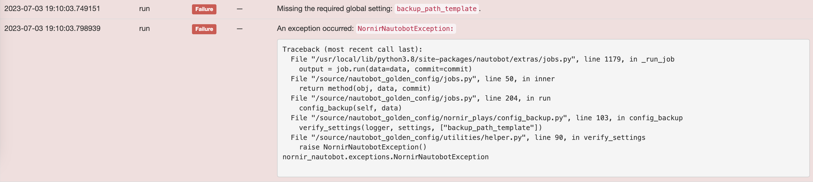
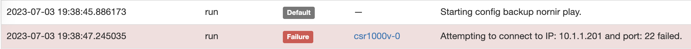

# General Troubleshooting Tips and Tricks

This troubleshooting article provides general troubleshooting tips and tricks for the Golden Configuration app.

### Where are the logs?
Golden config logs to the nautobot-worker facility. Where those logs are on specific deployments can vary on how the specific Nautobot instance was deployed and how. In general look in `journalctl` for logs for the system service defined for the worker. If the deployment is container based look in the celery worker logs for the specific container running that functionality.

### This job is not enabled to be run.

If you attempt to run any of the components of golden config and you see `This job is not enabled to be run.` on the job execution page this means you simply do not have the job enabled in Nautobot.

To fix this follow the steps below:
1. Navigate to **Jobs -> Jobs**.
2. Click on the job you're attempting to execute. Click `edit`.
3. Toggle the `enabled` field button.
4. Retest

### Where's the rerun job button?

By default Nautobot utilizes the job models field `Has sensitive variables` to determine whether a job execution will have a **rerun** button present on the page. If you've validated there is in fact no sensitive data in the job you can update this field. 

1. Navigate to **Jobs -> Jobs**.
2. Click on the job you're attempting to execute. Click `edit`.
3. Scroll to `Has sensitive variables` field button.
3. Toggle the `Override default value` button and then you can uncheck the `Has sensitive variables` toggle.
4. Retest

### Missing the required global setting

Golden config relies on multiple application specific settings to function. In most cases a job fails fast in these situations with errors similar to the screenshot posted below. 

To fix this follow the steps below:
1. Navigate to **Golden Config -> Settings**.
2. Click on the specific setting in use. Note: `Default Settings` is auto created upon application installation.
3. Ensure all settings and `paths` are configured.

See [Getting Started](../app_getting_started.md) for more information.

### Attempting to connect to IP <IP> and port: 22 failed.

This one is specific to running a configuration backup job. Specially within the `Backup Test` Golden Config Backup settings. This indicates that from the nautobot worker a tcp ping check against the management IP on port 22 was unsuccessful.

Suggestions:

- Validate from the Nautobot worker you can manually reach the IP + port of the system.

### General Connectivity Issues

Golden config uses Nornir for the framework that connects to devices and accomplishes a task. At the time of writing this the default dispatcher that Golden config uses are based off of `nornir_netmiko` and `nornir_napalm` functionality, this is a implementation detail at this time and is not a limitation.

Some generic issues that can be encountered tend to provide default exception logging directly from these underlying Nornir extensions. Most of which should be troubleshot in the same general manner.

- Validate from the Nautobot worker you can manually reach the IP + port of the system.
- Validate the device is not just slow to respond. (Exception tends to be related to the prompt not being found.)
- Test with underlying library optimizations disabled. E.g. Netmiko's fast_cli set to False.

If none of these troubleshooting steps helped identify the problem please visit the more specific troubleshooting steps.

- [Troubleshoot Credentials](./troubleshoot_credentials.md)
- [Troubleshoot Dispatchers](./troubleshoot_dispatchers.md)
